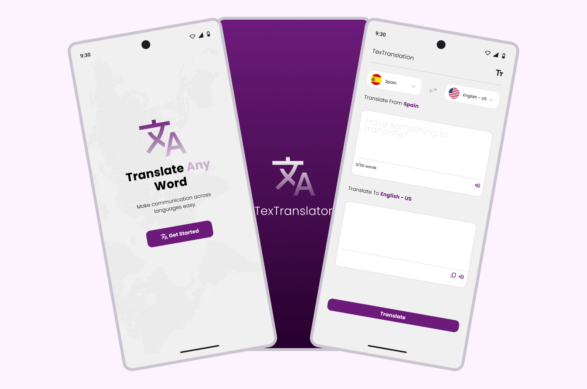

# TexTranslator 📚🔍

An application to translate words with Gemini AI API.


## Requerimientos

- Flutter SDK
- Dart SDK
- Android Studio (o cualquier IDE que soporte Flutter)
- Dispositivo o emulador Android/iOS

## Instrucciones

### 1. Clonar el repositorio

```bash
git clone https://github.com/ramon22mo/textranslator.git
cd textranslator
```

### 2. Instalar dependencias

```bash
flutter pub get
```

### 3. Configurar el archivo .env

Crea un archivo `.env` en la raíz del proyecto y agrega la siguiente línea:

```bash
GEMINI_API_KEY=YOUR_API_KEY
```

Reemplaza YOUR_API_KEY con tu API Key de Gemini API. Puedes obtenerla en [Gemini](https://ai.google.dev/gemini-api/docs/api-key?hl=es-419)

### 4. Ejecutar la aplicación

Conectra tu dispositivo o inicia un emulador y ejecuta el siguiente comando:
```bash
flutter run
```
